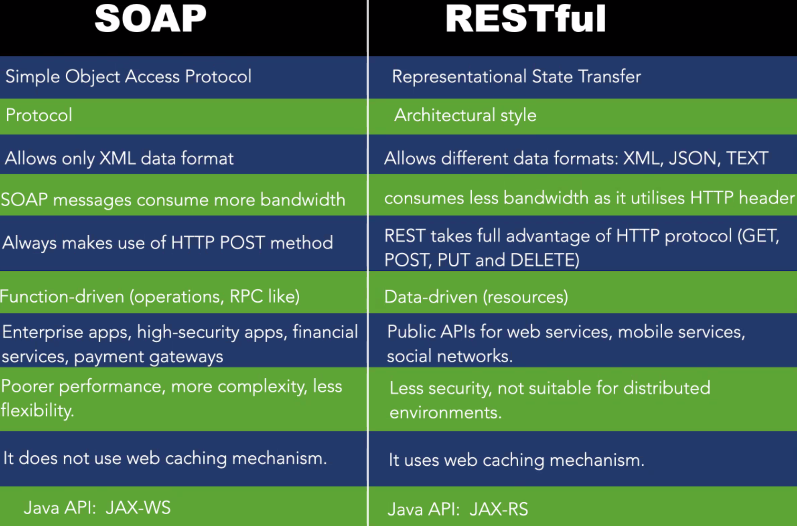

# RESTful Web Services

- Just uses HTTP
- SOAP uses verbs, REST uses nouns
  - SOAP Message with `multiply` operation inside
  - REST GET `/multiplication?a=3&b=5`

## What Is REST

- Representational state transfer
- REST is just a pattern (architectural style) for making APIs
- Using this API you can access resources
- Example:
  - Create an object on the server side and return the values of this object
  - Send the state of an object (using XML/JSON/...) to the client

## RESTful

- Focus on resources (nouns) not on operations (verbs)
- Every resource (noun) is uniquely addressable
- Stateless and cacheable
- Maps CRUD actions to HTTP methods (verbs)
  - Create -> POST
  - Read -> GET
  - Update -> PUT
  - Delete -> DELETE
- RESTful definition: an API (service) accessed via HTTP protocol at a predefined set of URIs

## Web As A RESTful Service

- URIs address resources
- HTTP methods provide constrained interface
  - POST: Pass a resource to be created underneath a new URI
  - GET: Pass a representation of the resource in the requested format
  - PUT: Create or Update the state of the resource
  - DELETE: Remove the given resource
- HTTP status codes to report the outcome of a REST operation
- HTTP headers play an active role

