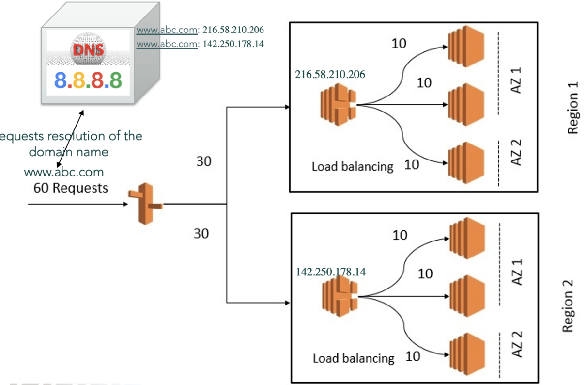

# Content Delivery Networks

## Content Distribution

- Serving web content is not trivial
- Latency
  - Content comes from nearby servers
  - Cache content
- Bottleneck
  - Serve requests from multiple servers
  - Reduce demand on site's infrastructure
  - ISPs profit a lot by localising content
- Single point of failure
  - Multiple servers and redundancy

## Load Balancing

- Load balancing: efficiently distributing incoming network traffic across a group of servers
- Nowadays, datacenters are spread around the world
- DNS can be used for initial load balancing
- Modern high-traffic websites must serve hundreds of thousands of concurrent requests from clients and return the correct text, images, video, or application data, all in a fast and reliable manner

- Multiple load balancers for redundancy and scalability
- A client would get a random subset of a few addresses out of a large pool of addresses of servers that all behaved identically

---

- DNS load balancing
- A load balancer distributes client requests or network load efficiently across multiple servers
- Load balancing algorithms
  - Round robin (sequentially)
    - Can also be augmented to be a weighted round robin
  - Least connections
  - Hash (e.g. the client IP address or the request URL)
  - Random
- The load balancer doesn't know if the server is capable of serving or not

### Load Balancer

- When a client requests resolution of the domain name, DNS returns the single server's IP address
- Many domains use multiple server machines and in this case DNS returns a list of all the servers' IP addresses (LBs) in response to a name resolution request

### Summary

- A reverse proxy can provide a load balancing solution which will distribute the incoming traffic evenly among the different servers to prevent any single server from becoming overloaded

### Software Vs. Hardware Load Balancers

- Software load balancing blends performance, cost and flexibility
- Hardware is robust, however hard to maintain and expensive

## Web Proxy

- Web proxies at the client's organisation serve HTTP requests (e.g. if-modified-since)
- Can reduce network load for popular, static content

## Content Distribution

- Static content distribution is offloaded to content distribution networks
  - Images, videos
  - CSS files
  - Static pages

### Content Distribution Networks (CDNs)

- Over 43% of the internet is consumed by Netflix, Google, Amazon, Facebook, Microsoft, and Apple
- A CDN is a highly-distributed platform of servers
- It helps minimise delays in loading web page content
- By reducing the physical distance between the server and the user

#### CDN Providers

- Akamai is a company evolved from MIT research
- Akamai deployed highly-distributed content delivery network with approximately 325,000 servers
