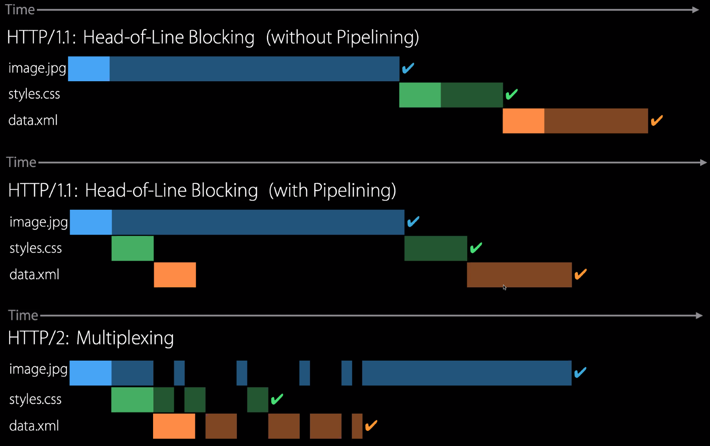

# HTTP

- Client/server model
- Client: browser that requests, receives (using HTTP) and displays web objects.
- Server: web server sends (using HTTP) objects in response to requests

## Responses

- Response is an object with headers coming first, each field separated by `\r\n` (CRLF)
  - Status line (e.g `200 OK`)
  - Has a `connection` line to say whether to keep the connection alive or not
- Pipelining lets the client send multiple requests at once, without waiting on the responses of those requests
  - HTTP is a stateless protocol
  - Can't trust it to order the files in the right way
  - If there's a huge image, it will block all requests that are later than it, no matter what

## Persistence

- HTTP persistent connection, also called HTTP keep-alive, or HTTP connection reuse, is the idea of using a single TCP connection to send and receive multiple HTTP requests/responses, as opposed to opening a new connection for every single request/response pair
- However there is a default connection timeout where the server would close the connection to avoid consuming resources

## HTTP 1.1 Head Of Line Blocking

- A server MUST send it's responses to the requests in the same order that the requests were received. WHY?
- HTTP is a stateless protocol, the client has no way to match the requests with the responses. It is reliant on the order the responses came back in
- If multiple requests are sent in parallel, and the first request takes longer to process (e.g processing a larger image), then all subsequent requests have to wait for the first one to be complete (head of line blocking)

## HTTP 2

- Multiplexing is using the same channel to send different bits of data

| HTTP\1.1                           | HTTP\2                   |
| ---------------------------------- | ------------------------ |
| Multiple TCP connections to a host | Only one TCP connection  |
| Head-of-line blocking              | Fully multiplexed        |
| FIFO restrictions                  | Requests have priorities |

## HTTP Caching Implementation

- Caching is a technique that can help network connections to be faster, because the less things need to be transferred, the better
- There are different caching strategies that are made available by HTTP and used by browsers

### 1. Cache Control

- The server can return a cache-control directive to specify how, and for how long (the `max-age` value), the browser should cache the individual response

### 2. ETag And If-None-Match

- The Etag (entity tag) response header is an identifier for a specific version of a resource

### 3. Last Modified

- TL;DR: Client receives a last modified header field, and then the client sends it back for the server to check the cache
- The browser can send a request to the server and instead of just asking for the page, it adds an `If-Modified-Since` header, based on the `Last-Modified` header value it got from the currently cached page
- This tells the server to only return a response body (the page content) if the resource has been updated since that date
- Otherwise the server returns a `304 Not Modified` response

## HTTP Cookies

- An HTTP cookie is a small piece of data that a server sends to the user's web browser
  - Sent in the header
- The browser may store it and send it back with later requests to the same server
- It remembers stateful information for the stateless HTTP protocol
- HTTP cookies are used to track, personalise, and save information about each user's session. A "session" just refers to the time you spend on a site
- Applications:
  - Session management (logins, shopping carts, game scores, anything else the server should remember)
  - Personalisation (user preferences, themes, other settings)
  - Tracking (recording and analysing user behaviour)

### Creating Cookies

- After receiving a HTTP request, a server can send one of more `Set-Cookie` headers with the response
  - `Set-Cookie: <cookie-name>=<cookie-value>`
- The cookie is usually stored by the browser, and then the cookie is sent with requests made to the same server inside a `Cookie` HTTP header
- An expiration date or duration can be specified, after which the cookie is no longer sent
