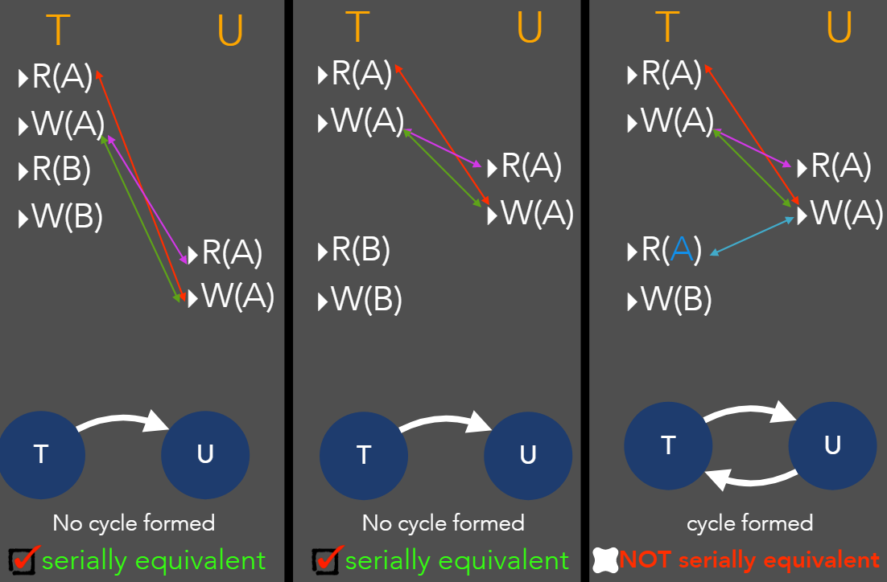

# Java Transaction API (JTA)

- Outline
  - Java transaction API
  - Transactions
  - Transactions - ACID properties
  - Concurrency
  - Concurrency problems
  - Conflicting operations
  - Serial equivalence

## Java Transaction API

- A multistep e.g making a payment
- Several method calls
- Read/write operation to one or more data sources
- A java transaction turns the operations into a single unit of action
  - Commit changes to the database (all)
  - Or rollback (none)
  - E.g
    - Begin transaction
    - `makePayment()`
    - `updateAccount()`
    - End transaction
- The transaction service enables Java EE applications to define a collection of methods that modify application data in such a way that either all the methods must complete successfully, or the whole set of method executions is rolled back as though nothing has ever happened

## Transactions

- A set of operations on objects to be performed as an indivisible unit by the servers managing those objects
- Ensure that all objects managed remain in a consistent state
  - When accessed by multiple clients
  - In the presence of server crashes
- Recoverable objects: can be recovered after a server crash

## Transactions - ACID properties

- Atomic
  - A transaction either completes successfully or has no effect at all (objects must be recoverable)
- Consistent
  - A transaction takes the system from one consistent state to another consistent state
- Isolated
  - No other process can change the data while the transaction is running (operations in transactions must be sufficiently synchronised)
    - Easiest approach is to do each transaction one after another (serial)
    - Goal is to maximise concurrency, so start multiple transactions at once
- Durable
  - After a transaction has completed successfully, all its effects are saved in permanent storage
- To ensure accuracy and data integrity

### Concurrency

- To ensure consistency and isolation of a transaction, transactions should be conducted serially one after another
- However, there are disadvantages to this approach such as reduced resource utilisation and overall inefficiency
- Interleaving (concurrency) of operations should produce the same effect as a non-interleaved execution
- The challenge is how do you increate the level of concurrency (transactions/sec) while still not violating the ACID properties of transactions
- About dealing with a lot of things at once
- Concurrency is when the execution of multiple tasks is interleaved instead of each task being executed sequentially one after another
- The appearance is that multiple actions are occurring at the same time

### Concurrency Problems

- Lost update problem (write-write conflict)
  - E.g 2 concurrent transactions both writing to the same record, but getting the record's value before either of the transactions sets the record
- Inconsistent retrievals problem (read-write conflict)
- Dirty read problem (write-read conflict)
- Premature writes

### Conflicting Operations

- Operations whose combined effect depends on the order in which they are executed
- No conflict:
  - Read/Read
- Conflict:
  - Write/Read
  - Read/Write
  - Write/Write
- Conflict if:
  - They belong to different transactions
  - They access the same data item
  - At least one is a write operation
- Pairs of conflicting operations

### Serial Equivalence

- Two transactions are serially equivalent if, and only if, all pairs of conflicting operations of the transactions are executed in the same order
- The final result must be the same as if all transactions would have been executed sequentially

### Premature writes

- The before image file(s) stores information about every transaction which makes a change to the database
- If the transaction is aborted, this information will be read back from the BI file to restore original values of the database back into the database if necessary
- Write operations must be delayed until earlier transactions that updated the same objects have either committed or aborted

## Concurrency Control Algorithms

- Locked based protocol
  - Widely used but can lead to deadlocks
- Two phase locking
- Optimistic
  - Assume that nothing bad will happen, later repair any mess that has been created
- Time stamping protocol
  - Timestamp ordering

### Lock-Based Protocols

- Main goal of concurrency control: to ensure the isolation property of concurrently running transactions: can be achieved via locks
- The most common way to achieve serial equivalence is through the use of locks
- Each data item is locked by at most one transaction
- Before accessing an object, the transaction must acquire a lock on that object
- While it is locked, no other transaction has access to it

#### Two-Phase Locking

- Each transaction has two phases:
  - Growing phase: a transaction may request new locks, but may not release any locks
  - Shrinking phase: a transaction may release locks, but may not request any locks

#### Strict Two-Phase Locking

- In many systems, locks are released only if the transaction commits or aborts (delaying read and write operations)
- A transaction that needs to read or write an object must be delayed until other transactions that wrote the same object have committed or aborted

### Deadlocks

- A state in which each member of a group of transactions is waiting for some other member to release a lock
- Wait-for graph to represent the waiting relationships between current transactions
- Deadlock detection
  - Detected by finding cycles in the wait-for graph
  - Presence of cycles (deadlocks) is checked each time an edge is added
- When a deadlock is detected, one of the transactions in the cycle must be aborted
- Which one? age of the transaction and number of CPU cycles

#### Timeouts

- Commonly used
- When a transaction is waiting for a resource that is locked by another transaction, it waits until one of the following occurs
  - The lock is granted
  - The end of a timeout period occurs
- The transaction may roll back the entire transaction and retry it later

### Disadvantages Of Locking

- Lock maintenance has overhead
- Deadlocks
- Locks cannot be released until the end of the transaction (concurrency is bad)
- Why not be optimistic?
  - The likelihood of two transactions accessing the same object can be low
