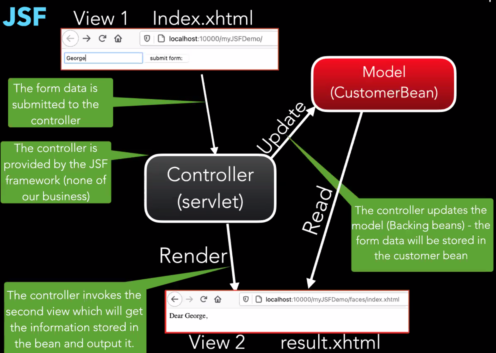

# JavaServer Faces

- Outline
  - Why JSF?
  - Components
  - Navigation
  - JSF lifecycle
  - Facelet
  - Tags
  - Expression Language (EL)
  - Managed beans
  - Converters
  - Validators
  - Listeners
- Servlet HTML is annoying to write

## JSF Overview

- Servlets still used, but combined with JSF
- JSF allows for modularisation
- JSF has 3 main components
  - Servlets (the controller)
  - View (the UI)
  - Model (the data store)
  - AKA MVC (model view controller)
- The flow
  - Controller (servlet) updates model
  - Then model is updated and goes back to the controller
  - Controller sends the updated UI to the view
  - The view gets the data from the model
  - Then the view renders the response
- JSF is a standard component-oriented UI framework for the Java EE platform
- JSF implements MVC design pattern
- This pattern helps to design different components separately
- JSF elements:
  - UI Component
  - Events and listeners
  - Renderer
  - Validators
  - Converters

## Model View Controller (MVC)

- Model view controller design pattern: a software pattern that is used when developing applications (and web applications)
- Separation of functions
  - Model encapsulates core data and functionality
  - View encapsulates presentation of data - there can be many views
  - Controller accepts input from users and makes requests from the model to produce a new view

## JSF Overview

- JSF is a standard component-oriented user interface framework for the Java EE platform
- JSF implements the MVC design pattern
- This pattern helps to design different components separately
- JSF elements:
  - UI Component
  - Events and Listeners
  - Renderer
  - Validators
  - Converters

## What Are Facelets

- Facelets is a powerful but lightweight page declaration language that is used to build JSF views
- Facelets features:
  - Use of XHTML for creating web pages
  - Support for tag libraries
  - Support for the expression language
- XHTML: HTML page with special JSF tags

### JSF Webpage

- Uses `.xhtml`
- Many tags, main one is `h` like `h:head`, `h:inputText`
- Reference the docs for the suite of tags
- Any `@ManagedBean(name = "customerBean")` tags will be added to the context when rendering the xhtml files
  - the `name` arg is optional, it defaults to lower camelcase of the class name
- E.g the flow:

## UI Components

- Components in JSF are elements like text box, button, radio buttons, panel, data grid, check box, table, etc.
- The faces servlet builds the view of the requested page as a component tree
- Each UI component represents a stateful object on the server which provides specific functionality for interacting with an end user
  - Stateful meaning it remembers what value it has if the client sends a request
- The component tree contains the information associated with all the components

## Tag Libraries

- Has many different types of tags:
  - `h`: <https://eclipse-ee4j.github.io/jakartaee-tutorial/jsf-page002.html>

## Validators

- User data can be validated before assigned to components
  - Standard validators - e.g min-max values, min-max length
  - Custom validators can be registered
- Commonly used JSF validator tags:
  - `f:validateLength`
  - `f:validateLongRange`
  - `f:validateDoubleRange`
  - `f:validateRegex`
  - `f:validateRequired`
  - Example: <https://canvas.sussex.ac.uk/courses/20455/pages/javaserver-faces-jsf-example-9>

## Converters

- The data from client to server travels as HTTP request parameter, when can be a string only
- In the backing bean or in the model layer the data can be any java object - this is where we need a converter
- A converter is a translator, which can convert an input string into some java object
- JSF provides a number of standard converters for common types, such as date and numbers
  - `f:convertNumber`
  - `f:convertDateTime`
- We can also develop our own custom converters

## Backing Beans

- In a JSF application, there are some JavaBean objects, which handle or store data between the business model and UI component at intermediate stage
- These JavaBean objects are known as backing beans
- Backing beans model part: contain business logic and data, while the view part consists of presentation logic with UI components
- The beans that are configured are also known as managed beans. Therefore, all backing beans are managed beans

### Managed Beans

- A java class with a default constructor, a set of properties and a set of methods that perform functions for a component
- The `@Named` (javax.inject.Named) annotation in a class, along with a scope annotation, registers the object as a resource with JSF

#### JSF Managed Scopes

- Determines when the bean is destroyed
- `javax.faces.bean`
  - `@ApplicationScoped` - persists when the application is running
  - `@SessionScoped` - persists across multiple HTTP requests in a web app
  - `@RequestScoped` - persists during a single HTTP request in a web app
  - `@Dependent` - indicates that the bean depends on some other bean
  - `@ViewScoped` - persists throughout the view's lifetime
  - `@FlowScoped` - goes along with faces flows (a set of views in a flow)

## Navigation Model

- A web application is a collection of web pages linked together in a partcular sequence to solve a particular purpose, such as shopping
- However, if the web application is small (consisting of two or three pages) it is a simple task to dispatch the client's request to an appropriate view; but it becomes complex to keep track of all the paths when the size of an application (number of web pages) increases to enterprise level
- Implicit navigation
  - E.g if a button has a `action="response"` the user will be taken to the `response` page
- User-defined navigation
  - JSF provides an efficient yet simple way to configure all navigation rules declaratively in a single location

## Event And Listener Model

- Action events: when the user activates a component that implements `ActionSource2`
- There are two types of action listeners, one that affects navigation, and the other does not
  - The action listener, which doesn't affect navigation executes the code, modifies backing bean or application model, and redisplays the current page
  - On the other hand, the action listener which affects navigation, executes the logic and returns the output to navigation model to select the next page to be displayed to the client
- Value-change event: when the user changes the value of a component represented by `UIInput`

### JSF Event Handling

- In JSF, when a button is clicked or change of value in a text field, etc. Then the corresponding JSF component create an instance of the corresponding event class and adds the event to the event list
- After adding the event to the event list, the JSF component will call the corresponding listener or handler method

## Expression Language

- Method expressions
  - Invoke an arbitrary public method of a bean - can return a result
- Parameterized method calls
  - E.g `action="#{customer.submit(customer.name)"`

## Renderers

- JSF introduces renderers, which completely separate the functionality of a component from the presentation logic on the client-side
- The renderers are child components of UI components and used to set and get data from UI components
- A JSF UI component is capable of rendering itself, which is known as direct rendering
- The view is rendered as a response to the client
- A renderer class is responsible for handling the encoding, which is a process of creating the presentation of UI components in some markup language for the given client (e.g HTML)
