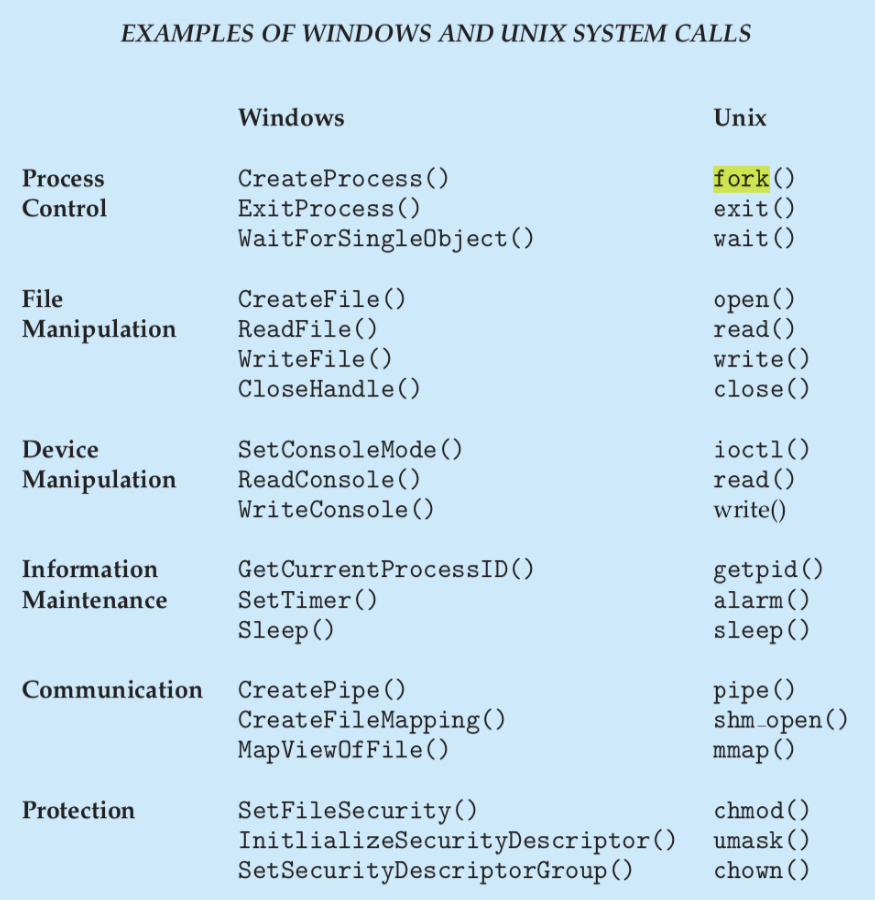
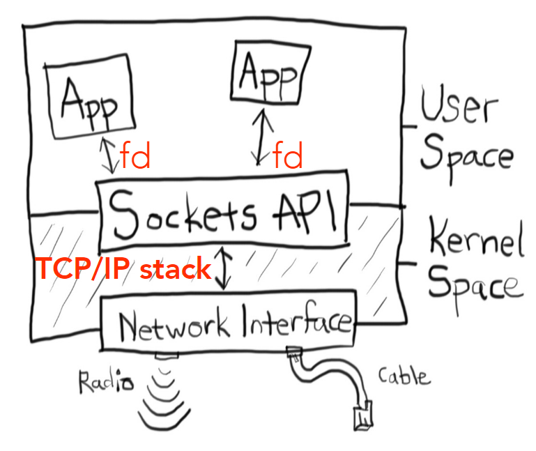
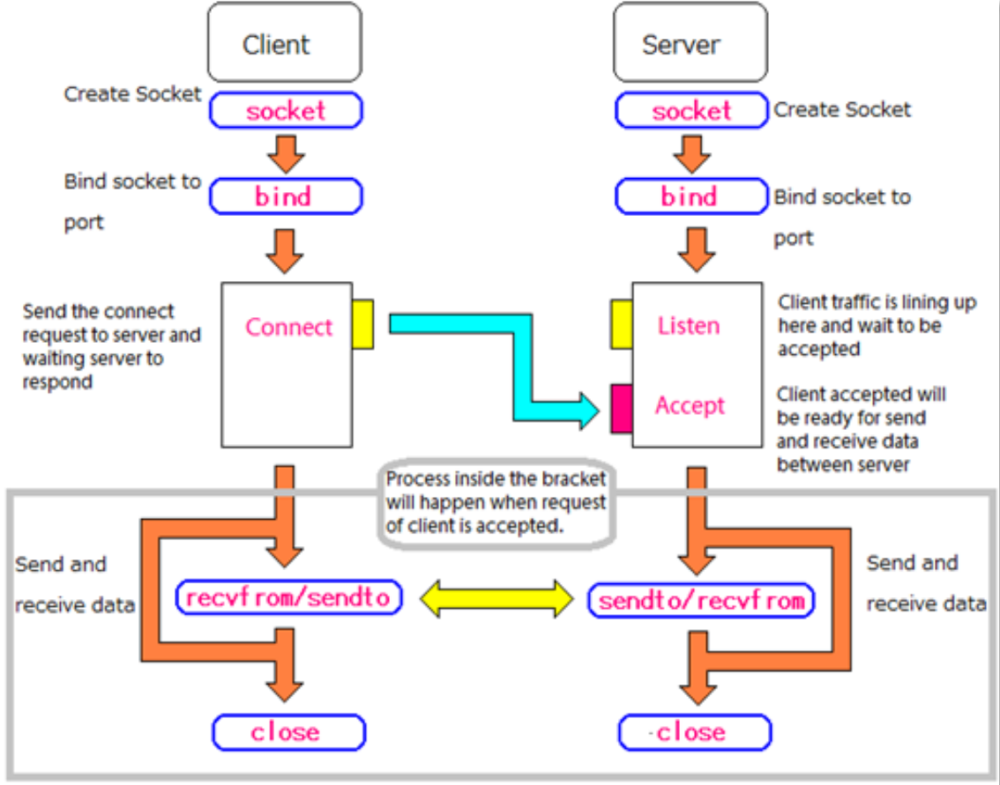

# Operating Systems Background

- Overview
  - Operating systems background
  - Socket API
  - Process and Threads
  - Server implementation
  - HTTP

---

- In user mode, the executing code has no ability to directly access hardware
- In kernel mode, unrestricted access to the underlying hardware
- A system call is a way for programs to interact with the operating system's kernel

## Socket API

- The socket abstracts a communication channel and is the kernel-based TCP/IP stack interaction interface
- TCP code operates in kernel space in response to packet arrival and process requests
- Common function calls that use sockets are: creation (socket), initialisation (bind), connecting (connect), waiting for a connection (listen, accept), closing a socket (close)

- An IP socket is associated with an IP address, the transport layer protocol used (TCP, UDP, etc.) and a port
- A file descriptor is just an integer, but it refers to an open file object in a given process

## Process And Threads

- Processes are running versions of a program
- If there's only 1 process on the server, then the server can only handle 1 client
- Each process has it's own address space, with a heap, a stack per thread
- One or more threads of control running in parallel, each executing sequential instructions

## Server Implementation

### 1. A Process-Per Connection HTTP Server

- With a master process
- The server listens on a well-known port for new connection requests
- When a new connection request arrives, the system delivers the connection to the server application via the `accept()` system call
- Forked a new process to handle each HTTP connection
- Multi-process servers can suffer from context-switching and interprocess communication overheads

### 2. A Single-Process Single Threaded Server (No Event Loop)

- A single threaded server can only deal with one client at a time
- This is unacceptable in terms of performance (e.g web servers)

### 3. A Single-Process Multi-Threaded Server

- In the single-process multi-threaded model, each connection is assigned to a unique thread
- The thread that handles the connection is blocked until there is some data to read, or the data is fully written. Until the relevant operation is complete that thread can do nothing else but wait
- There are a few drawbacks to this approach. E.g., at any given point in time there can be multiple threads just waiting for the client requests and that is just a waste of resources

### 4. A Single-Process Single Threaded Server (Event Loop)

- An infinite loop that constantly checks (polls) if data is returned from IO
- Implemented using `select()`, `poll()`, `epoll()`, `kqueue()` system call family
- `processEvent` must not block
- Single-threaded (eases life)
