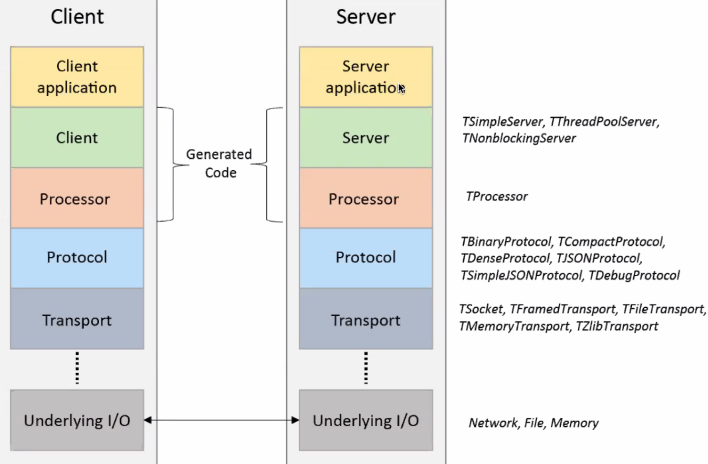

# RPC: Apache Thrift And Protocol Buffers

- RPC: a server will get another server to do some operation
- RPC implementations include apache thrift as well as gRPC (google's rpc)
- Multiple formats:
  - XML
  - JSON
  - TBinaryProtocol (thrift - implemented in apache thrift)
  - Protocol buffers (inside gRPC)
- RPC: communication between servers
- Formats: data serialisation

## Apache Thrift

- Language-independent software stack for RPC
- Developed at facebook, now hosted on apache
- Open sourced in 2007
  - Designed by an X-Googler
- Allows to create cross-language services
- Supports more than 20 languages
- Uses an IDL (interface description language)

### Thrift Data Types In IDL

- Base types:
  - bool
  - byte (char)
  - i16 16 bit int
  - i32
  - i64
  - double
  - string
- Structs
- Containers: list, set, map
- Special types
  - Binary: sequence of unencoded bytes
- Exceptions
- Service definitions
  - A service consists of a set of named functions, each with a list of parameters and a return type

#### Structs

- Every field must have a unique, positive integer identifier (Field ID)
- Fields may be marked as required or optional
- Structs may contain other structs
- You may specify an optional "default" value for a field
- Multiple structs can be defined and referred to within the same thrift file

### IDL

- Thrift uses datatypes and service interfaces in a single language-neutral file (IDL)
- Compiling this file generates all the necessary code to build RPC clients and servers

```thrift
namespace java calculator
service CalculatorService {
  multiply(1:i32 n1, 2:i32 n2)
}
```

- Arguments can be primitive types or structs (likewise for return types)
- Method definitions are terminated with commas or semi-colons

```thrift
service Twitter {
  // Void is a valid return type for functions
  void ping(),
  bool postTweet(1:Tweet tweet) throws (1:TwitterUnavailable unavailable),
  TweetSearchResult searchTweets(1:string query);
  // Oneway means the client doesn't wait for a response
  oneway void zip()
}
```

### Thrift Architecture

- The thrift stack:
  - Your code
  - `Fooservice.Client`
  - `Foo.write()`/`Foo.read()`
  - TProtocol
  - TTransport
  - ...
  - Underlying I/O

#### Network Stack

- Transport layer: a simple abstraction for reading/writing from/to the network
- Protocol layer: a mechanism to map in-memory data structures to a wire-format (how datatypes use the underlying Transport to encode/decode themselves) (JSON, XML, plain text, compact, binary)
- Processor: dispatcher to our service - generated by compiler



- Main protocols:
  - `TBinaryProtocol`
  - `TCompactProtocol`
  - `TJSONProtocol`

### Example CLient-Server Application

- Defining the thrift file

```thrift
namespace java calculator
service CalculatorService {
  multiply(1:i32 n1, 2:i32 n2)
}
```

- Compiling and generating the code

```properties
thrift --gen java calculator.thrift
```

- Running the above command generates a java file called `CalculatorService.java`
- Understanding the generated code
  - There will be multiple classes inside the `CalculatorService` module
  - Client Class: this has the interfaces defined to communicate with the thrift server over the transport protocol, server ip, and port
  - Processor class: this acts as a controller class for service which has the skeleton already implemented

#### Writing A Simple Client

```java
TTransport transport = new TSocket(host, port);
TProtocol protocol = new TBinaryProtocol(transport);
CalculatorService.Client client = new CalculatorService.Client(protocol);
int result = client.multiply(3, 5);
```

- Protocol layer: provides serialisation and deserialisation. Thrift supports the following protocols:
  - TBinaryProtocol - a straight forward binary format encoding numeric values as binary, rather than converting to text
  - TCompactProtocol - very efficient, dense encoding of data
  - TJSONProtocol - uses JSON for encoding of data
  - ...
- Transport layer: is responsible for reading from and writing to the wire. Thrift supports the following:
  - TSocket - uses blocking socket I/O for transport
  - TFramedTransport - sends data in grames for a non-blocking server
  - TMemoryTransport - uses memory for I/O. The java implementation uses a simple `ByteArrayOutputStream` internally
  - ...

#### Writing A Service Handler

- The service handler (CalculatorHandler) implements the `Iface` interface
- In CalculatorService.java:

```java
// In CalculatorService.java:
...
public interface IFace {
  public int multiply(int n1, int n2) throws TException;
}
...

// In CalculatorHandler.java
public class CalculatorHandler implements CalculatorService.Iface {
  @Override
  public int multiply(int n1, int n2) throws TException {
    return n1 * n2;
  }
}
```

#### Writing A Simple Server

```java
CalculatorHandler handler = new CalculatorHandler();
Calculator.Processor processor = new Calculator.Processor(handler);
TServerTransport serverTransport = new TServerSocket(9090);
TServer server = new TSimpleServer(new Args(serverTransport).processor(processor));
```

- The processor class (auto-generated by thrift) reads data from the input, processes the data (actually uses the handler specified by the user to process the data) and then writes the processed data to the output
- Supported servers. A server will be listening for connections to a port and will send the data it receives to the processor to handle
  - TSimpleServer - a single-threaded server using std blocking io. Useful for testing
  - TThreadPoolServer - a multi-threaded server using std blocking io
  - TNonBlockingServer - a multi-threaded server using non-blocking io (java implementation uses NIO channels). TFramedTransport must be used with this server

## Data Serialisation

- Data serialisation formats, various ways to convert complex objects to sequences of bits
- Map in-memory data structures to a wire-format (how datatypes use the underlying Transport to encode/decode themselves) (JSON, XML, plain text, compact, binary)
- Binary format VS text format

| Binary Format          | Text Format |
| ---------------------- | ----------- |
| Thrift TBinaryProtocol | JSON        |
| Protocol Buffers       | XML         |

- Text = human readable, binary = not human readable
- Binary protocols
  - HTTP 2
    - Frame format (structured format)
      - Like a TCP packet
    - Reading an HTTP/2 frame can follow a defined process
    - An HTTP/2 message can be sent in one or more frames
    - Multiplexed messages REMEMBER
- Text protocols
  - HTTP 1.1
    - Unstructured format made up of lines of text in ASCII encoding (a stream of characters)
    - It's not very time efficient, because you need to look at each byte (e.g, to see if it's the newline)
      - Process it character by character
