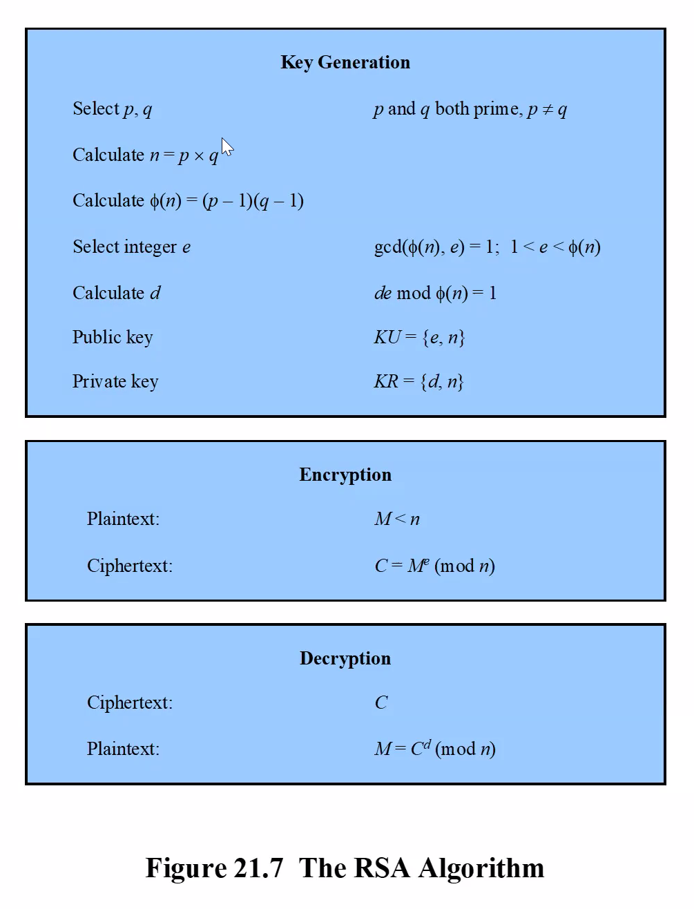

# Security

- CIA
  - Confidentiality
    - Oly authorised individuals/systems can view sensitive or classified information
  - Integrity
    - Only authorised individuals/systems are allowed to modify the data
  - Availability
    - Able to serve information when it's needed

## Cryptographic Algorithms

- A message is encrypted by the sender applying some rule to transform the plaintext
- The receiver will then apply the inverse of the algorithm to get the plaintext back
- Symmetric
  - DES
  - AES
- Asymmetric
  - RSA
  - Diffie-hellman
  - ECC
- Hash
  - MD
  - SHA

## Symmetric Key

- The sender and receiver of a message share a single, common key that is used to encrypt and decrypt the message
- Examples:
  - DES (data encryption standard)
    - Has a 56 bit key (7 bytes)
  - AES (advanced encryption standard)
    - Has a 128, 192, or 256 bit key

---

- Two copies of the key which we need to keep secure
- We also need to distribute this key to users
- Relatively CPU efficient
- The number of symmetric keys required: `n(n-1)/2`
  - `n`: number of people who are communicating

## Asymmetric Encryption

- Also referred to as public-key algorithms, asymmetric-key algorithms use paired keys (a public and a private key) in performing their function
- The public key is known to all, but the private key is controlled solely by the owner of that key pair
- Asymmetric algorithms use the concept of key pairs
- Public and private keys are mathematically linked
- The keys cannot be derived from each other
- If you know someone's public key, you cannot derive their private key
- Asymmetric cryptography is slower than symmetric, but more scalable
  - For 10,000 users, asymmetric needs 20,000 keys, but symmetric needs 49,995,000 keys
- Anything encrypted with a public key, means that it can be decrypted with the corresponding private key
- One-way functions are sometimes called Humpty Dumpty functions
  - IF YOU ARE EVER IN A PUB QUIZ, THIS IS ESSENTIAL
- The only thing that makes one key "private" and the other one "public" is which one I choose to share. There is nothing different between them that would make it so that I would have to choose one over the other for "private"

## Digital Signatures

- Electronic signatures have carried the same legal weight as traditional, paper-based ones. This legislation ensures that electronic signatures are legally binding
  - **Authentic** - it convinces the recipient that the signer deliberately signed the document and they are who they claim they are
  - **Unforgeable** - it provides proof that the signer, and no one else, deliberately signed the document - the signature cannot be copied and placed on another document
  - **Non-repudiable** - the signer cannot credibly deny the document was signed by them
- Hashing is a one-way function. unlike encrypted data, hashes of data do not contain all the information needed to re-create the original input
- You can calculate the hash for any message but there is no way to get back the original message if all you have is the hash
  - Humpty Dumpty
- For example, a commonly used hash function is `SHA-256` which produces a 256-bit hash (writing this in hexadecimal requires 64 characters)
  - Secure Hash Algorithms (SHA)

## Secure Hash Algorithms

- SHA256
- Has a weakness which are rainbow tables
  - A rainbow table is a precomputed table for caching the output of cryptographic hash functions, usually for cracking password hashes

### Overcoming The Rainbow Table

- Highly secure service providers use additional security feature, e.g Salt and Pepper

### Salt

- A salt is a non-secret value
- Unique for each user
- Stored in a database
- Added to the password before it gets hashed
- Example:
  - Password: `football`
  - Salt: `xANi`
  - Hash function input: `footballxANi`

### Pepper

- Same for every user
- Isn't stored in the database "secret"
- E.g a constant stored in plaintext in the application code
- Example:
  - Password: `football`
  - Salt: `xANi`
  - Pepper: `1EDW7p13WgwnOKYT046`
  - Hash function input: `footballxANi1EDW7p13WgwnOKYT046`

## Digital Certificates

- Someone who signs certificates
- Has a known public key(s)
- "Famous" enough for this to be useful
- Anyone who has the certificate authority's public key (we all have this key) can decrypt the certificate
- Only the CA has the private key, meaning only they can change/update the certificate

## Java EE Security: Realm

- Realm: a security policy domain defined for an application server
  - Contains a collection of users belonging to one or more groups
  - File realm - user credentials locally in a file named keyfile
  - Certificate realm - user credentials in a certificate database
  - JDBC realm - credentials stored in a database
- User: an individual that has been defined in the server
- Group: a set of authenticated users
- Role: an abstract name for the permission to access a particular set of resources in an application
- The java EE server authentication service can govern users in multiple realms. The file, admin-realm, and certificate realms come preconfigured for the glassfish server
