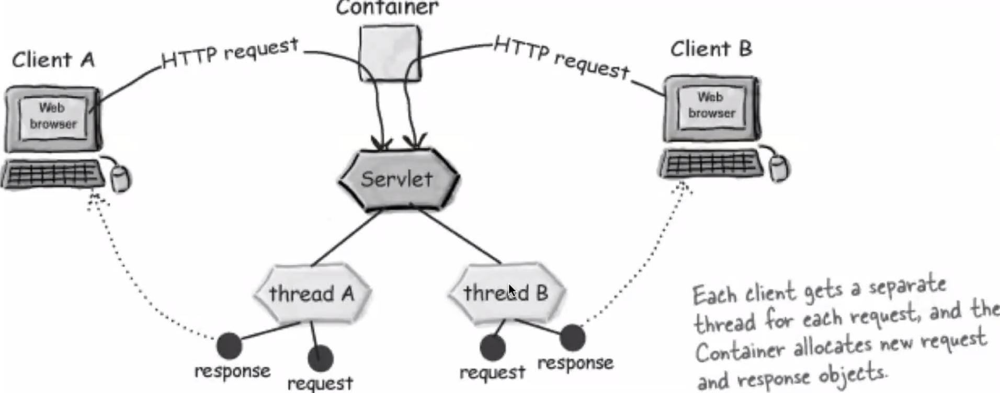

# Servlets

- Stuff with dynamic content - i.e request/response objects
- Looks like a similar concept to a single django view method

## Java EE Made Of Two Containers

- Web container
- Enterprise JavaBeans (EJB) Container

## Web Containers

- To handle multiple requests, you use multiple instances of the servlets class
  - This is inefficient, as instances take a lot of memory
- Thread safety - if multiple threads are accessing the same resource, they may overwrite eachother
- Web container will control the lifecycle of the servlet
- The container runs multiple threads to process multiple requests to a single servlet
- And every client request generates a new pair of request and response objects
- Servlets are not thread-safe

## What Is A Servlet

- Servlets do not have a main() method - there is no such thing as a main method in Java EE
- Servlets are managed by the web container
- `Servlet` - interface
- `GenericServlet` - abstract class
- `HTTPServlet` - abstract class (the one we're going to be using)

## Servlet Lifecycle

- Controlled by the web container
- Web container will loads the servlet class and creates an instance of the servlet
- A HTTP request is mapped to a servlet. The web container calls the `service()` method, passing request and response objects
- A servlet is unloaded `destroy()` by the container if the container shuts down or if the container reloads the whole web application at runtime

## Servlet Instantiation

- The same servlet will work on the requests from all other clients
- The container creates a new thread that calls `service()` method for each client request but accesses the same instance of the servlet
- The `service()` method dispatches the request to the correct handler method based on the type of request (e.g `POST` requests go to the `doPost` method)

## Examples

- Get/post examples
- Over and back dynamic content using URL parameters
- Can also use cookies
