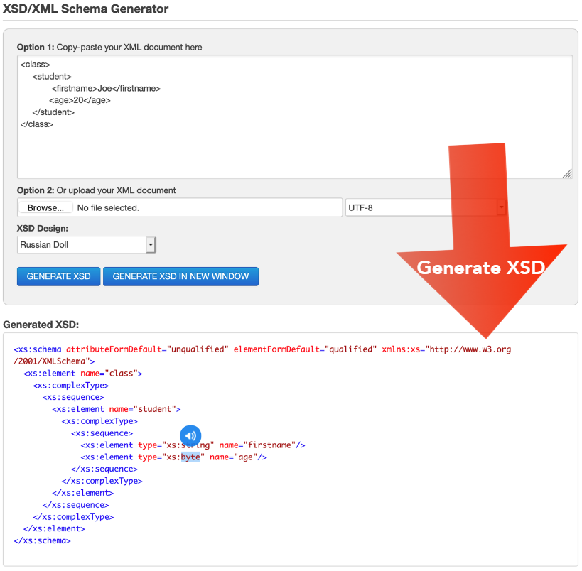

# Web Services

- Outline:
  - Web services as a remote procedure call (RPC)
  - XML and XSD
  - Simple object access protocol (SOAP)
    - Web service definition language (WSDL)
    - XML schema definition (XSD)
    - WSDL message
    - HTTP (POST)
  - Implementing SOAP client
- RPC-style communication on top of the web
- Service consumer sends request to service provider using the provider's API
- A web service is any piece of software that makes itself available over the internet
- Accessible via a standard web protocol (e.g HTTP)
- Suited for machine-to-machine communication
- There can be aggregator services which collect information from external services to then serve the client
  - E.g travel agent services need to know about hotel bookings/flights/hire cars

---

- A way of utilising services on remote machines
- On top of HTTP
- Like RPC but
  - With different communication protocol
  - Different interface description language

## Web Services: Usage

- Reusable application-components
  - E.g currency conversion, weather reports, language translation services
- Connect existing software
  - E.g exchange data between different applications and different platforms
- Access functionality
  - E.g google web service

---

- Any application can have a web service component

## Web Services Types

- Two main types
  - Simple object access protocol (SOAP)
    - HTTP (POST)
    - Format: XML
  - Representational state transfer (REST)
    - HTTP (POST, GET, PUT, DELETE, ...)
    - Format: XML, JSON, TEXT, ...

### SOAP VS REST

- REST kinda like a post card
  - Lightweight, no sealing/opening required to read the message
- SOAP kinda like an envelope
  - Fold letter, seal it, has to be opened
- SOAP has extra overhead, more bandwidth required

### Simple Object Access Protocol (SOAP)

- SOAP is a messaging protocol specification for exchanging structured information in the implementation of web services in a distributed environment
- SOAP is an XML based protocol for accessing web services
- A web service has a URI
- Transport (usually) over HTTP
- Initially XML-RPC
- It consists of 4 concepts:
  - XSD schema
  - WSDL (XML)
  - SOAP XML messages
  - HTTP (POST)

### SOAP: Usage

- Used for enterprise-level web services that require high security and are complex transactions
- Used examples of SOAP APIs
  - Financial services
  - Payment gateways
  - Identity management
  - CRM (customer relationship management)
  - Telecommunication services
- PayPal public API

## XML And XSD

- XML: extensible markup language
- XSD: XML schema definition
- XSD is used to describe and validate the structure and the content of XML data
- Example:

## WSDL

- WSDL = web services description language
- WSDL is used to describe web services
- WSDL is written in XML
- Programming language independent
- The interface definition language for web services
- Java has a mapping for it's own types to the WSDL types
- Consists of:
  - `Types` - a container for data type definitions using some type system (such as XSD)
  - `Message` - an abstract, typed definition of the data being communicated
    - `Port Type` - an abstract set of operations supported by one or more endpoints
      - `Operation` - an abstract description of an action supported by the service
  - `Binding` - a concrete protocol and data format specification for a particular port type
  - `Service` - a collection of related endpoints
    - `Port` - a single endpoint defined as a combination of a binding and a network address
- You have the data types
- Apply those data types to messages
- Those messages are put together in the port type section to create the operations
- The operations are bundled into a service
- The service as an endpoint a URL which a user can reach

## XSD

- XSD = XML schema definition
- It's a description of datatypes and thus static properties of the service - it's about data

### SOAP Message

- A soap message is an ordinary XML document containing:
  - An envelope element that identifies the XML document as a SOAP message
  - An optional header
  - A body element that contains request and response information
  - A fault element containing errors and status information (e.g resulting from incorrect message format)
