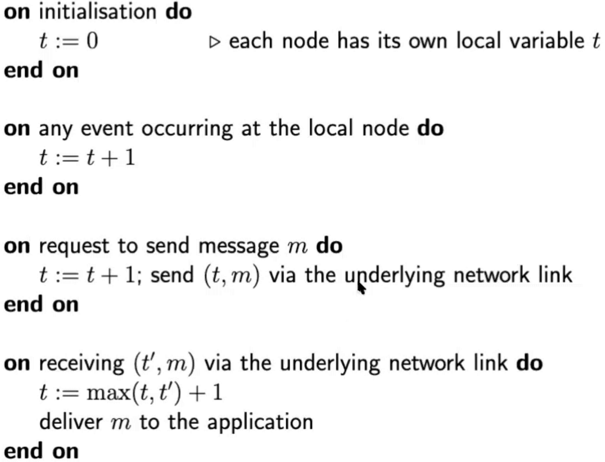

# Time In Distributed Systems

- The time sync used to be a luxury a long time ago
  - Today it's a must
- Time is an important issue in distributed systems
  - Each processor has its own internal clock and its own notion of time
  - Goal: to achieve the correct order of events
  - Timestamp events and actions
- Time is an important issue in distributed systems
- Examples:
  - Debugging and troubleshooting is much easier when the timestamps in the log files of all devices are synchronised
  - Digital certificates - we need to make sure that we use a valid certificate based on date and time
  - Eliminate processing of duplicate updates
  - Consistency of distributed data (timestamps in transactions)
- Challenges:
  - Clocks are not accurate
  - No absolute, global time
  - Network delays, message processing delays

## Timers In Computers

- Based on frequency of oscillation of a quartz crystal
- Computer clocks tend not to be in perfect agreement

### Clock drift

- Clocks tick at different rates
- Ordinary quartz clocks drift by 1 second in 11.6 days
  - 10^-6 seconds/second
- High-precision quartz clocks drift rate:
  - 10^-7 or 10^-8 seconds/second

### Clock Skew And Drift

- Clock skew:
  - The difference between the readings of any two clocks at one point in time

## External sources

- Clocks can be synchronised to external sources of highly accurate time
- Physical clocks
  - Universal Coordinated Time (UTC)
  - International Atomic Time (IAT)

### UTC (Universal Coordinated Time)

- UTC is an international standard for timekeeping
- UTC signals are synchronised and broadcast regularly from land-based radio stations and satellites

### Atomic Time

- Accurate atomic clocks use the element Caesium-133
- These atomic clocks can communicate that time using NTP
- 400 atomic clocks exist nowadays

## The Leap Second

- Every now and then, we add a leap second to our clocks to synchronise them with the earth's slowing rotation
- A leap second is a one-second adjustment that is occasionally applied to UTC, to accommodate the difference between precise time (as measured by atomic clocks) and imprecise observed solar time
  - Adding a leap second creates a minute with 61 seconds
- We add leap seconds every now and then to ensure our clocks reflect the earth's rotation speed as accurately as possible

## Synchronisation To A Time Server

- Suppose a server with an accurate clock (e.g GPS-disciplined crystal oscillator) - could simply issue an RPC to obtain the time
  - Message delays will have outdated the server's answer
- Wall clock time synchronisation
  - Cristian's algorithm
  - Berkeley algorithm
  - NTP
- Logical time
  - Lamport clocks
  - Vector clocks

### Cristian's Method For External Time Syncrhonisation

- A method for clock synchronisation which can be used in distributed systems
- Steps:
  - T1: Client's local clock timestamp
  - T2: Server's local clock timestamp when T1 is received
  - T3: Server's local clock timestamp when a response is sent
  - T4: Client's local clock timestamp when the response is received
- Round trip time (RTT): T4 - T1
- Propagation time = RTT / 2
- Client sets clock: T3 + RTT/2
- Use several request/response messages to increase accuracy

### The Berkeley Algorithm

- The berkeley algorithm is a method of clock synchronisation in distributed computing
- It assumes no machine has an accurate time source
- Obtains average from participating computers and synchronises clocks to that average
- A leader is chosen via an election process
- The leader polls the followers who reply with their time in a similar way to christian's algorithm
- The leader observes the round-trip time (RTT) of the messages and estimates the time of each follower and it's own
- The leader then averages the clock times
- The leader then sends out the amount (positive or negative) that each follower must adjust its clock
- No single point of failure - faulty clocks are ignored
- Re-election required when master fails
- The whole system can drift away from UTC
- Is master telling the truth?

### The Network Time Protocol (NTP)

- Used to synchronise the clocks of machines on the internet
- A reference clock (stratum 0) clock: they have the most accurate time data
- In atomic clocks: it would take more than double the age of the universe years to drift by a second
- Each level away from the atomic clock is called a stratum
- A stratum number is used to measure the believability of a time source
- Stratum 0 means a device is directly connected to e.g., a GPS satellite
- The NTP protocol does not allow clients to accept time from a stratum 15 device
- In operation since before 1985, NTP is one of the oldest internet protocols in current use
- NTP is a UDP-based protocol - it uses UDP port `123`
- The client must compute it's
  - Round-trip delay
    - `d = (T4 - T1) - (T3 - T2)`
    - Estimated server time when client receives response
    - `= T3 + (d / 2)`
  - Time offset
    - `c = T3 + (d / 2) - T4`
    - `T3 + (d / 2)` should be the same as `T4` if the client has the right time
- The "Delay" is the time that was needed to transfer the packet in the network and the "Offset" is the time difference of the two computer clocks
- PPM stands for parts per million of time in a 24-hour period (1 PPM = 10^(-6)s/s)
  - E.g if a clock has an error of 100ppm, translated it's 100/10^6
  - Number of seconds in a day = `24 * 60^2 = 86400`
  - So total error on a day is `86400 * 100/10^6 = 8.64` seconds per day

#### NTP: Time Correction

- Offset is generally measured in milliseconds
- Corrections are applied gradually, so it may take up to three hours until the frequency error is compensated
- Corrections are in the form of slowing down/speeding up the quartz clock in a computer
- Slow change
  - Offset < 125 ms
  - Slightly speed the clock up or slow it down by up to 500ppm
- Step change
  - 125ms < offset < 1000s
  - Suddenly reset client clock to estimated server timestamp
- Panic state
  - Offset > 1000s
  - Leave the problem for a human operator to resolve

### Time Synchronisation

- The important aspect of monotonic time source is NOT the current value, but the guarantee that the time source is strictly linearly increasing, and thus useful for calculating the difference in time between two samplings.

### Logical Time

- Physical clock: count number of seconds elapsed
- Logical clock: count number of events occurred
- The logical clock is just a counter that increments based on events in the system
  - E.g., lamport clocks algorithm
- Each process in a distributed system can use a logical clock to causally order all the events that are relevant to it

### Lamport Clocks Algorithm

- If event A happened before event B, then the Lamport timestamp of A is less than the Lamport timestamp of B
- Clocks (initially 0) are incremented by 1
- Used to determine the order of events in a distributed system
